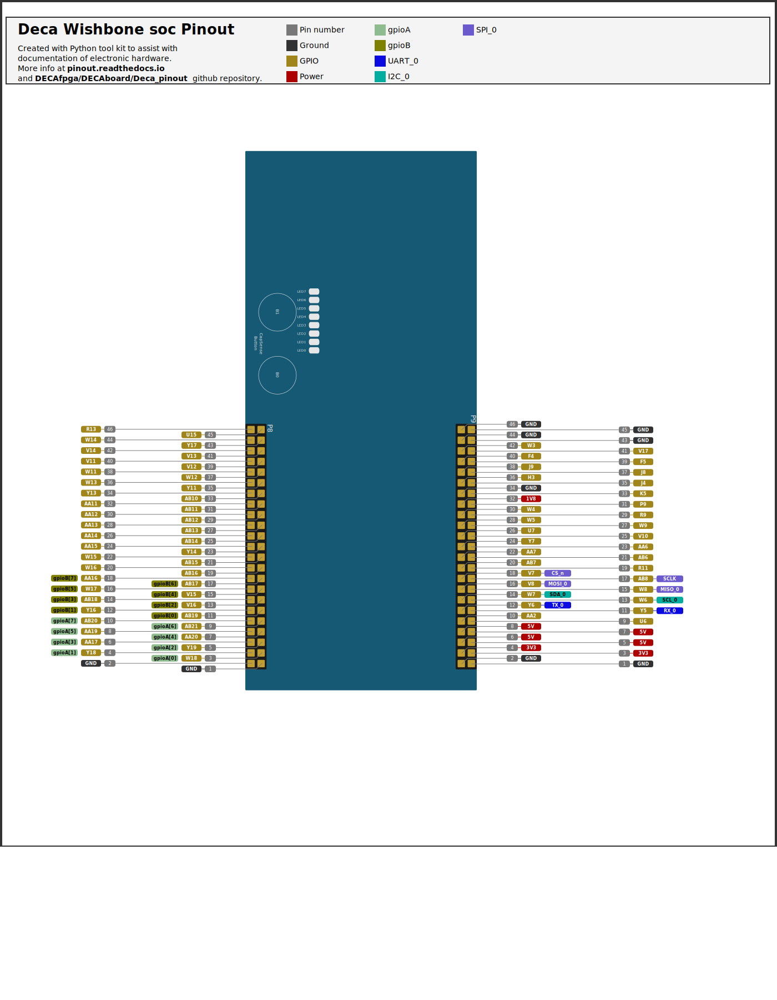

# Examples of bare metal RiscV programming with a softcore on a fpga #

This is a work in progress.


Bought a Deca board a few month ago to learn RiscV with a VexriscV cpu and wishbone bus to interface peripherals.
For now my project is just programming RiscV bare metal, just basic stuff.

In summary, I use fusesoc wishbone bus generator and VexriscV wishbone ibus and dbus. But VexriscV wishbone dbus need a little modification to make it compatible with fusesoc wishbone bus implementation.

I have added support to modify .mif file from Tom Verbeure tutorial. No need to recompile hardware each time.


## Package required

* pyyaml
```console
  pip install pyyaml

```
* python-yaml
```
sudo apt-get install python-yaml

```
* [fusesoc](https://github.com/olofk/fusesoc)
```
pip install fusesoc
```
* quartus 20.1  

At the end of .bashrc file add:
```
export QUARTUS_VERSION=20.1
export PATH="/home/__your_user_name__/intelFPGA_lite/$QUARTUS_VERSION/quartus/bin:$PATH"
```


* RiscV toolchain https://github.com/riscv/riscv-gnu-toolchain or
 get [pre-build binary](https://static.dev.sifive.com/dev-tools/riscv64-unknown-elf-gcc-8.3.0-2020.04.0-x86_64-linux-ubuntu14.tar.gz)
 
 
To compile from source:
```
 git clone https://github.com/riscv/riscv-gnu-toolchain.git
 cd  riscv-gnu-toolchain
 ./configure --prefix=/opt/riscv --enable-multilib
 sudo make -j N
```
  where N is the number of processors.

At the end of .bashrc file add

```
export PATH=/opt/riscv/bin:$PATH
```

My FuseSoc workspace folder is ~/Documents/bin/fusesoc.  Adapt to your own folder. Also adapt paths to quartus binary and riscv toolchain.

## Getting project files ##

```
git clone https://github.com/infphyny/FpgaRiscV.git
```

Inside the cloned directory  
```
 fusesoc library add fusesoc_cores https://github.com/fusesoc/fusesoc-cores
 fusesoc library add gpio https://github.com/infphyny/gpio
```
Check inside fusesoc_cores/wb_intercon directory. If version number is lower than 1.3, get latest version

```
fusesoc library add wb_intercon https://github.com/olofk/wb_intercon
```


## Building and executing an example ##

cd sw/Deca/accelerometer
1. Compile software that generate .hex and .mif files
```
make
```
2. Generate bitstream (.sof file) and upload  ~ 5 min.
```
make hw
```
Note that make hw need to be done only once except if hardware source code is modified.

3. To update bram of the bitstream with new binary
```
make update_ram
```

4. To upload the previously generated bitstream:
 ```
make upload
```
5. To do a simulation:
```
make sim
```
Then ctrl-c after few seconds because .vcd file grow fast ~1 GiB/5s


6. To view assembly generated by riscv toolchain
```
make objdump
```


## Terminal output 


 P9:11  GPIO1_D[0]  RX (Green C96 cable)   / P9:12  GPIO1_D[1]   TX  (White C96 cable)

Execute program
```
picocom -b 115200 /dev/ttyUSB0   
```
or open Arduino IDE then choose serial monitor.

- Pinout

  View 


##  Deca RiscV soc properties ##
* VexRiscv cpu that implement RiscV 32 imc instructions set with a Wishbone bus.
* Frequency: 75 MHz
* Ram: 128k
* Interupt controller from Dan Gisselquist ZipCpu 
* KEY0 is wired to reset.
* Uart RX need to be connected or pull high, otherwise Uart tx will be halted (SpinalHDL Uart implementation feature).
* To modify frequency, go in rtl/Deca/pll, execute quartus then choose pll for MAX10 and overwrite pll.v
* If frequency is changed, modify the fixed frequency in WbUart.scala and regenerate the WishboneUartCtrl.v to keep 115200 baud rate.        
* To modify the ram size: Modify RAM_SIZE in Makefiles. Adjust gp and sp in crt0.S. Modify mem size parameter of Wishbone generator (wb_intercon) in Deca.core.  


##  TODO 
* Better documentation for pin out.
* Add documentation on how to generate the VexRiscv.v file from Vexriscv github repository.   
* Show .vcd file location that generated from simulation.  


## List of hardware library 

* [VexRiscV cpu](https://github.com/SpinalHDL/VexRiscv.git) 
* [Hardware libraries](https://github.com/fusesoc/fusesoc-cores.git) provided by fusesoc
* ZipCpu [interrupt controller](https://github.com/ZipCPU/zipcpu/blob/master/rtl/peripherals/icontrol.v) 

## Documentation
* How to generate a [linker script](sw/doc/linker_script.md) and https://twilco.github.io/riscv-from-scratch/2019/04/27/riscv-from-scratch-2.html.
* How to update bram from a previously generated bitstream: https://tomverbeure.github.io/2021/04/25/Intel-FPGA-RAM-Bitstream-Patching.html and https://github.com/tomverbeure/fpga_quick_ram_update

* Tom Verbeure [ulpi](https://github.com/tomverbeure/panologic-g2/blob/master/spinal/src/main/scala/periph/UlpiCtrl.scala) hardware source code  

