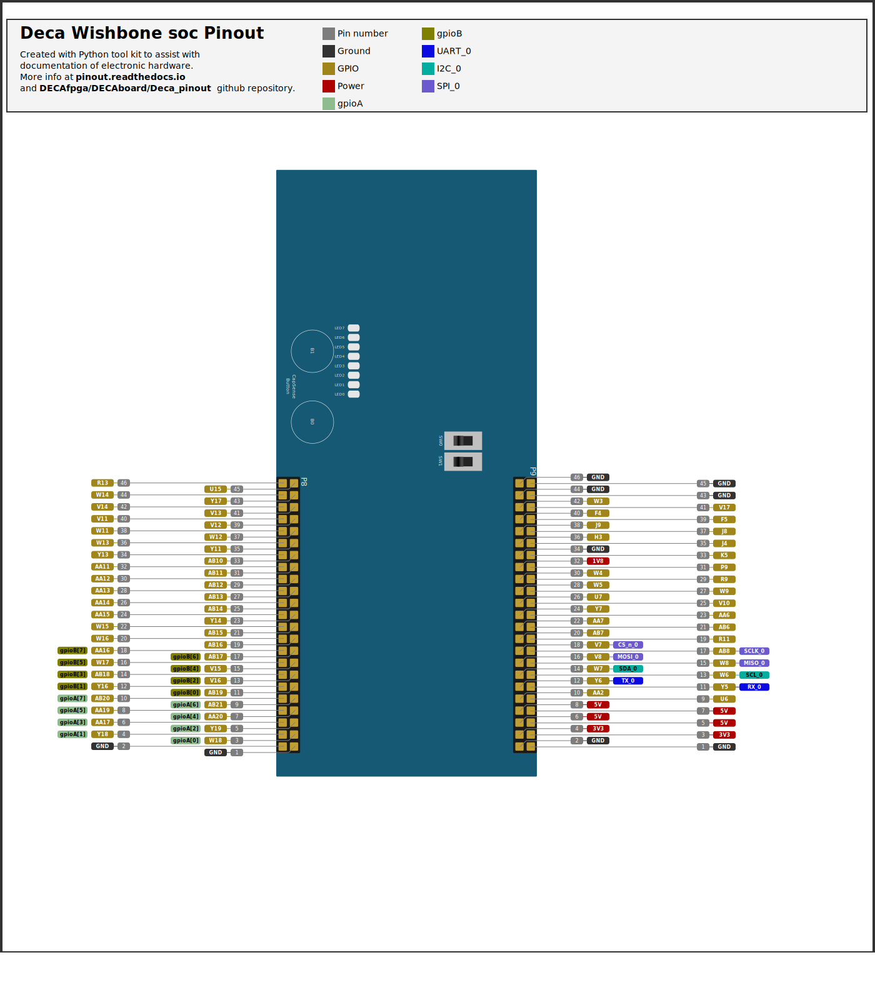

# Examples of bare metal RiscV programming with a softcore on a fpga #

This is a work in progress. Next thing to implement is a HDMI controller for video output. 
 
Bought a Deca board a few month ago to learn RiscV with a VexriscV cpu and wishbone bus to interface peripherals.
For now my project is just programming RiscV bare metal, just basic stuff.

In summary, I use fusesoc wishbone bus generator and VexriscV wishbone ibus and dbus. But VexriscV wishbone dbus need a little modification to make it compatible with fusesoc wishbone bus implementation.

I have added support to modify .mif file from Tom Verbeure tutorial. No need to recompile hardware each time.

DDR3 with Intel IP work but implementation is not optimized. Write speed is ~12MiB/s. So no burstmode with burst size greater than one supported right now. 

Started to work on DDR3 memory support, but signals have some glitches that prevent the ddr3 example to run reliably. Still investigating on that problem, 
Run time vary from 0s to 30 minutes. Need to push Key0 on the board (reset button of the soc) a couple of times to be able to make it run. 


Started to work on usb. When building hardware, the timing requirements are not met because of TUSB1210 hardware controller but other peripherals still works.   


## Package required

* python 3
  
```console
sudo apt install python-is-python3
```

* python pip 
```console
 sudo apt install python3-pip
```
* pyyaml
```console
  pip install pyyaml
```
* python-yaml
```
sudo apt-get install python-yaml

```
* [fusesoc](https://github.com/olofk/fusesoc)
```
pip install fusesoc
```
* quartus 20.1  

At the end of .bashrc file add:
```
export QUARTUS_VERSION=20.1
export PATH="/home/__your_user_name__/intelFPGA_lite/$QUARTUS_VERSION/quartus/bin:$PATH"
```


* RiscV toolchain [from source](https://github.com/riscv/riscv-gnu-toolchain) or get [pre-build binary](https://static.dev.sifive.com/dev-tools/riscv64-unknown-elf-gcc-8.3.0-2020.04.0-x86_64-linux-ubuntu14.tar.gz) 
  
  

<!--
 ```
  sudo apt install gcc-riscv64-unknown-elf
  sudo apt install picolibc-riscv64-unknown-elf
 ```
 --> 
 
 
 
To compile from source:
```
 git clone https://github.com/riscv/riscv-gnu-toolchain.git
 cd  riscv-gnu-toolchain
 ./configure --prefix=/opt/riscv --enable-multilib
 sudo make -j N
```
  where N is the number of processors.

At the end of .bashrc file add

```
export PATH=/opt/riscv/bin:$PATH
```

* Recent version of [verilator](https://github.com/verilator/verilator) to be able to do simulation.

TODO: add instruction to build verilator from source


My FuseSoc workspace folder is ~/Documents/bin/fusesoc.  Adapt to your own folder. Also adapt paths to quartus binary and riscv toolchain.

## To be able to program Deca board
See [usb blaster udev](https://www.intel.com/content/dam/www/programmable/us/en/pdfs/literature/ug/ug_usb_blstr.pdf) chapter 3.2.2. Installing on Red Hat Enterprise 5 and 6

execute
``` console
sudo nano /etc/udev/rules.d/51-usbblaster.rules
```
Copy inside that file
```
BUS=="usb", SYSFS{idVendor}=="09fb", SYSFS{idProduct}=="6010", 
MODE="0666"
BUS=="usb", SYSFS{idVendor}=="09fb", SYSFS{idProduct}=="6810", 
MODE="0666"
```


## Getting project files ##

```
git clone https://github.com/infphyny/FpgaRiscV.git
```

Inside the cloned directory  
```
 fusesoc library add fusesoc_cores https://github.com/fusesoc/fusesoc-cores
 fusesoc library add gpio https://github.com/infphyny/gpio
 fusesoc library add wb_avalon_bridge https://github.com/infphyny/wb_avalon_bridge
```
Check inside fusesoc_cores/wb_intercon directory. If version number is lower than 1.3, get latest version

```
fusesoc library add wb_intercon https://github.com/olofk/wb_intercon
```


## Building and executing an example for DecaWishbone soc ##

cd sw/Deca/DecaWishbone/accelerometer
1. Compile software that generate .hex and .mif files
```
make
```
2. Generate bitstream (.sof file) and upload  ~ 5 min.
```
make hw
```
Note that make hw need to be done only once except if hardware source code is modified.

3. To update bram of the bitstream with new binary
```
make update_ram
```

4. To upload the previously generated bitstream:
 ```
make upload
```
5. To do a simulation:
```
make sim
```
Then ctrl-c after few seconds because .vcd file grow fast ~1 GiB/5s


6. To view assembly generated by riscv toolchain
```
make objdump
```


## Terminal output 

To view serial output from the soc execute the following program
```
picocom /dev/ttyUSBX --baud 115200 --imap lfcrlf 
```
where X is usb port number or use Arduino IDE serial monitor.

- [Pinout](https://raw.githubusercontent.com/infphyny/FpgaRiscV/main/data/Deca/DecaWishbone/pinout/DecaWishbone.svg)
   
  


##  Deca RiscV soc properties ##
* VexRiscv cpu that implement RiscV 32 imc instructions set with a Wishbone bus.
* Frequency: 50 MHz
* Ram: 128k
* Interupt controller from Dan Gisselquist ZipCpu 
* KEY0 is wired to reset.
* Uart RX need to be connected or pull high, otherwise Uart tx will be halted (SpinalHDL Uart implementation feature).
* To modify frequency, go in rtl/Deca/pll, execute quartus then choose pll for MAX10 and overwrite pll.v
* If frequency is changed, modify the fixed frequency in WbUart.scala and regenerate the WishboneUartCtrl.v to keep 115200 baud rate.        
* To modify the ram size: Modify RAM_SIZE in Makefiles. Adjust gp and sp in crt0.S. Modify mem size parameter of Wishbone generator (wb_intercon) in Deca.core.  


##  TODO 
* Add documentation on how to generate the VexRiscv.v file from Vexriscv github repository.   
* Show .vcd file location that generated from simulation.  


## List of hardware library 

* [VexRiscV cpu](https://github.com/SpinalHDL/VexRiscv.git) 
* [Hardware libraries](https://github.com/fusesoc/fusesoc-cores.git) provided by fusesoc


## Documentation
* How to generate a [linker script](sw/doc/linker_script.md) and https://twilco.github.io/riscv-from-scratch/2019/04/27/riscv-from-scratch-2.html.
* How to update bram from a previously generated bitstream: https://tomverbeure.github.io/2021/04/25/Intel-FPGA-RAM-Bitstream-Patching.html and https://github.com/tomverbeure/fpga_quick_ram_update

* Tom Verbeure [ulpi](https://github.com/tomverbeure/panologic-g2/blob/master/spinal/src/main/scala/periph/UlpiCtrl.scala) hardware source code  

